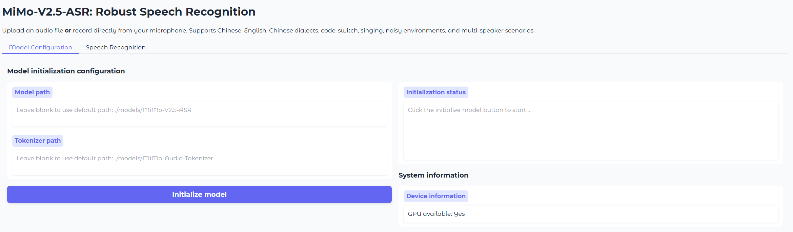

<div align="center">
  <picture>
    <source srcset="https://github.com/XiaomiMiMo/MiMo-VL/raw/main/figures/Xiaomi_MiMo_darkmode.png?raw=true" media="(prefers-color-scheme: dark)">
    
  </picture>
</div>

<div align="center">
  <h3>
    <b>
      <span>━━━━━━━━━━━━━━━━━━━━━━━━━━━━━━━</span><br/>
      MiMo-V2.5-ASR: Robust Speech Recognition Across<br/>
      Languages, Dialects, and Complex Acoustic Scenarios<br/>
      <span>━━━━━━━━━━━━━━━━━━━━━━━━━━━━━━━</span>
    </b>
  </h3>
</div>

<br/>

<div align="center" style="line-height: 1;">
  |
  <a href="https://huggingface.co/collections/XiaomiMiMo/mimo-v2.5-asr" target="_blank">🤗 HuggingFace</a>
  &nbsp;|
  <a href="https://huggingface.co/spaces/XiaomiMiMo/MiMo-V2.5-ASR" target="_blank">🚀 Online Demo</a>
  &nbsp;|
  <a href="https://xiaomimimo.github.io/MiMo-V2.5-ASR-Demo" target="_blank">📰 Blog</a>
  &nbsp;|

  <br/>
</div>

<br/>

## Introduction

**MiMo-V2.5-ASR** is a state-of-the-art end-to-end automatic speech recognition (ASR) model developed by the Xiaomi MiMo team. It is built to deliver accurate and robust transcription across Mandarin Chinese and English, multiple Chinese dialects, code-switched speech, song lyrics, knowledge-intensive content, noisy acoustic environments, and multi-speaker conversations. MiMo-V2.5-ASR achieves state-of-the-art results on a wide range of public benchmarks.

## Abstract

Automatic speech recognition systems are expected to faithfully transcribe speech signals that originate from diverse languages, dialects, accents, and domains, and that are captured under a wide variety of acoustic conditions. While conventional end-to-end models perform well on in-domain data, they still fall short of real-world requirements in challenging scenarios such as dialect mixing, code-switching, knowledge-intensive content, noisy environments, and multi-speaker conversations. We present **MiMo-V2.5-ASR**, a large-scale end-to-end speech recognition model developed by the Xiaomi MiMo team. Through large-scale mid-training, high-quality supervised fine-tuning, and a novel reinforcement-learning algorithm, MiMo-V2.5-ASR achieves systematic improvements along the following dimensions:

- 🗣️ **Chinese Dialects**: Native support for Wu, Min-nan, Cantonese, Sichuanese, and other major Chinese dialects.
- 🔀 **Code-Switch**: Fluent transcription of Chinese–English code-switched speech without any language tag prompting.
- 🎵 **Song Lyrics**: Accurate lyric transcription for both Chinese and English songs, even when vocals are mixed with accompaniment.
- 🔊 **Noisy Conditions**: Robust recognition in high-noise and far-field environments.
- 👥 **Multi-Speaker**: Accurate transcription of overlapping and cross-talk conversations, such as meeting scenarios.
- 🇬🇧 **Complex English Scenarios**: Leading performance among non-English-only models on English multi-speaker meeting benchmarks such as AMI.
- 📚 **Knowledge-Intensive Recognition**: Precise recognition of classical poetry, technical terminology, and named entities (people, places, organizations).

## Results

MiMo-V2.5-ASR has been evaluated across a broad set of benchmarks spanning standard Mandarin and English, Chinese dialects, lyric recognition, and internal business scenarios. The chart below summarizes the average performance of MiMo-V2.5-ASR across these scenarios.


For per-benchmark numbers and specific qualitative cases, please refer to our [blog](https://xiaomimimo.github.io/MiMo-V2.5-ASR-Demo).

## Model Download

| Models   | 🤗 Hugging Face |
|-------|-------|
| MiMo-Audio-Tokenizer | [XiaomiMiMo/MiMo-Audio-Tokenizer](https://huggingface.co/XiaomiMiMo/MiMo-Audio-Tokenizer) |
| MiMo-V2.5-ASR | [XiaomiMiMo/MiMo-V2.5-ASR](https://huggingface.co/XiaomiMiMo/MiMo-V2.5-ASR) |

```bash
pip install huggingface-hub

hf download XiaomiMiMo/MiMo-Audio-Tokenizer --local-dir ./models/MiMo-Audio-Tokenizer
hf download XiaomiMiMo/MiMo-V2.5-ASR --local-dir ./models/MiMo-V2.5-ASR
```

## Getting Started

Spin up the MiMo-V2.5-ASR demo in minutes with the built-in Gradio app.

### Prerequisites (Linux)

* Python 3.12
* CUDA >= 12.0

### Installation

```bash
git clone https://github.com/XiaomiMiMo/MiMo-V2.5-ASR.git
cd MiMo-V2.5-ASR
pip install -r requirements.txt
pip install flash-attn==2.7.4.post1
```

> \[!Note]
> If the compilation of flash-attn takes too long, you can download the precompiled wheel and install it manually:
>
> * [Download Precompiled Wheel](https://github.com/Dao-AILab/flash-attention/releases/download/v2.7.4.post1/flash_attn-2.7.4.post1+cu12torch2.6cxx11abiFALSE-cp312-cp312-linux_x86_64.whl)
>
> ```sh
> pip install /path/to/flash_attn-2.7.4.post1+cu12torch2.6cxx11abiFALSE-cp312-cp312-linux_x86_64.whl
> ```

### Run the Demo

```bash
python run_mimo_asr.py
```



This launches a local Gradio interface for MiMo-V2.5-ASR. You can:

* Upload an audio file **or** record directly from your microphone.
* Optionally specify a **language tag** (Chinese / English / Auto) to bias the model for a specific language, or leave it to **Auto** for automatic language detection (recommended for code-switched speech).
* The demo calls the `asr_sft()` interface under the hood.

To load the model and tokenizer automatically at startup, pass their paths on the command line:

```bash
python run_mimo_asr.py \
    --model-path ./models/MiMo-V2.5-ASR \
    --tokenizer-path ./models/MiMo-Audio-Tokenizer
```

Otherwise, enter the local paths for `MiMo-Audio-Tokenizer` and `MiMo-V2.5-ASR` in the **Model Configuration** tab, then start transcribing!

## Python API

Basic usage with the `asr_sft` interface:

```python
from src.mimo_audio.mimo_audio import MimoAudio

model = MimoAudio(
    model_path="./models/MiMo-V2.5-ASR",
    tokenizer_path="./models/MiMo-Audio-Tokenizer",
)

# Automatic language detection (recommended for code-switching)
text = model.asr_sft("path/to/audio.wav")
print(text)

# With explicit language tag
text_zh = model.asr_sft("path/to/audio.wav", audio_tag="<chinese>")
text_en = model.asr_sft("path/to/audio.wav", audio_tag="<english>")
```

## Citation

```bibtex
@misc{coreteam2026mimov25asr,
      title={MiMo-V2.5-ASR: Robust Speech Recognition Across Languages, Dialects, and Complex Acoustic Scenarios},
      author={LLM-Core-Team Xiaomi},
      year={2026},
      url={https://github.com/XiaomiMiMo/MiMo-V2.5-ASR},
}
```

## Contact

Please contact us at [mimo@xiaomi.com](mailto:mimo@xiaomi.com) or open an issue if you have any questions.
